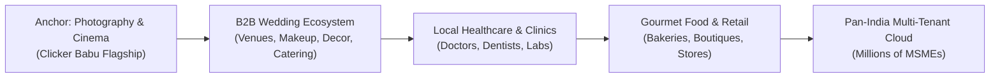
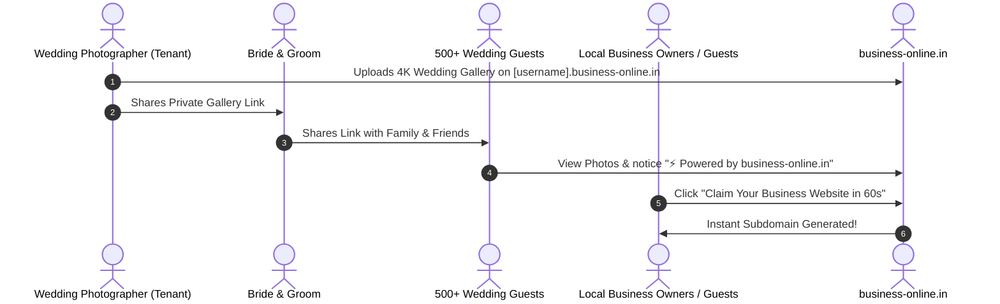

# business-online.in — Master Vision, Product Strategy & Multi-Year Roadmap

> **Document ID:** `DOC-01-VISION`  
> **Status:** Ground Truth / Active Blueprint  
> **Target Audience:** Founders, Future AI Agents, Core Engineers, Product Managers  
> **Version:** 1.0 (Enterprise Baseline)

---

## 1. Executive Summary & The Market Opportunity

India is home to over **63 million MSMEs and local service professionals**. While physical goods retail has seen platforms like Shopify and Dukaan, the **service, creative, and local appointment sectors** (photographers, clinics, bakeries, salons, consultants, wedding vendors) remain fundamentally underserved.

### The Current Market Failure:
1. **Justdial / IndiaMART Model (Spam & Outdated):**
   - High upfront cost (₹20,000–₹60,000/year).
   - Zero branded identity: Vendors do not get their own independent modern website.
   - Toxic Lead Distribution: 1 customer inquiry is broadcast to 10 competing vendors, resulting in aggressive cold calls and low conversion.
2. **Wix / Squarespace / Shopify Model (Too Complex & Expensive):**
   - Pricing in USD ($16–$45/month), requiring international credit cards.
   - High technical friction: Local business owners cannot spend 40 hours building drag-and-drop templates.
   - Zero built-in local marketplace discovery.

### The `business-online.in` Solution:
`business-online.in` is an **Instant Multi-Tenant Website Cloud + Hyper-Local Verified Directory Engine**. Any business owner claims their free white-labeled subdomain (`[username].business-online.in`) in **60 seconds**, receives a luxury mobile-first portfolio, automated Google Local SEO, and direct-to-WhatsApp leads with zero code and zero friction.

---

## 2. Core Value Proposition & Principles

```
┌────────────────────────────────────────────────────────────────────────┐
│                        business-online.in                              │
│             "Apne Business Ko Online Le Aayein 60s Mein"               │
├──────────────────────────────────┬─────────────────────────────────────┤
│   For the Local Business Owner   │       For the End Customer          │
├──────────────────────────────────┼─────────────────────────────────────┤
│ • Instant custom subdomain       │ • Discover 100% verified businesses │
│ • Zero technical skills needed   │ • View authentic 4K portfolios/menus│
│ • Direct WhatsApp customer leads │ • Zero spam: Direct 1-on-1 contact  │
│ • Automated Google #1 Local SEO  │ • Lightning fast mobile load (<0.5s)│
└──────────────────────────────────┴─────────────────────────────────────┘
```

### Guiding Principles for all Engineers & AI Agents:
1. **WhatsApp Native Above All:** Indian business owners live on WhatsApp, not on desktop dashboards. Every lead, review, and booking must interface seamlessly with WhatsApp.
2. **Sub-500ms Edge Performance:** Every tenant site (`[username].business-online.in`) must load instantly even on 4G connections in Tier-2/3 cities.
3. **Ultra-Luxury Aesthetics:** No generic ugly directory pages. Every tenant gets a tailored aesthetic that matches top 1% global design standards.
4. **Zero Commission on Deals:** We charge a predictable SaaS subscription, never taking a cut from the vendor's hard-earned transaction.

---

## 3. The "Photography Wedge" Strategy (Hero Vertical)

Rather than launching horizontally across 50 categories on Day 1, `business-online.in` utilizes the **Vertical Wedge Strategy**, anchoring on **Wedding Photography & Cinema**.



### Why Photography is the Perfect Wedge:
* **High Transaction Value:** Average wedding booking ranges from ₹75,000 to ₹15,00,000. Photographers readily invest in premium software that wins them high-ticket clients.
* **Extreme Visual Appeal:** High-definition imagery and couture wedding films create an immediate "WOW" factor for anyone visiting the platform.
* **The Wedding Vendor Network:** Photographers collaborate directly with every major local vendor (Banquet Hall owners, Caterers, Makeup Artists, Decorators). One onboarded photographer naturally introduces 10+ new business leads to `business-online.in`.

---

## 4. The Viral Growth Flywheel (Zero-CAC Engine)

The platform has a built-in viral distribution loop that drastically reduces Customer Acquisition Cost (CAC):



---

## 5. Business Model & Monetization Architecture

| Tier | Price | Target Audience | Key Features Included |
| :--- | :--- | :--- | :--- |
| **Starter (Free)** | ₹0 / Forever | New vendors & micro-shops | • `[username].business-online.in`<br>• Verified Directory Listing<br>• Up to 6 Portfolio items<br>• Direct WhatsApp Lead Button |
| **Pro Growth** | **₹499 / month**<br>(₹4,999 / year) | Independent Studios, Clinics & Cafes | • Connect Custom Domain (`brand.com`)<br>• Unlimited 4K Gallery items<br>• Removal of Platform Watermark<br>• Priority Directory Ranking<br>• Automated Local SEO Schema |
| **Studio Enterprise** | **₹1,499 / month**<br>(₹14,999 / year) | High-end Studios & Multi-Location Brands | • Client Proofing & Photo Selection Portal<br>• WhatsApp Cloud API Automated Notifications<br>• Multi-staff CRM Dashboard<br>• Dedicated Cloudflare Edge SSL |

---

## 6. Multi-Year Phased Execution Roadmap

### 📍 Phase 1: Foundation & Raipur Validation (Months 1–2)
* **Milestones:**
  - Wildcard DNS setup (`*.business-online.in`) on Cloudflare / Edge.
  - Deploy flagship tenant **Story by Clicker Babu** on `clickerbabu.business-online.in`.
  - Onboard first 15–25 local photography studios and wedding vendors in Raipur.
  - Test live lead flow and direct WhatsApp conversion rates.

### 📍 Phase 2: Wedding Vertical Domination & Pro Monetization (Months 3–5)
* **Milestones:**
  - Launch Client Proofing & 4K Photo Delivery Module for photographers.
  - Expand to surrounding wedding verticals (Bridal Makeup, Banquet Venues, Event Caterers).
  - Launch Razorpay / Cashfree subscription checkout for **Pro Growth Tier**.
  - Reach ₹1,00,000+ Monthly Recurring Revenue (MRR).

### 📍 Phase 3: Central Directory & Multi-City Expansion (Months 6–12)
* **Milestones:**
  - Rollout automated Programmatic SEO targeting Tier-2 & Tier-3 cities across Central & Northern India (Bilaspur, Durg-Bhilai, Indore, Nagpur, Jaipur, Lucknow).
  - Activate the Justdial-style hyper-local search discovery engine with rating badges.
  - Add self-serve automated onboarding for Healthcare (Clinics/Dentists) and Gourmet Food.

### 📍 Phase 4: Pan-India Enterprise Scale (Year 2+)
* **Milestones:**
  - Scale to 50,000+ active tenants across 100+ cities.
  - Launch native mobile app (Android & iOS) for Vendor CRM and Instant Lead Management.
  - Launch Custom Domain Automation Engine via Cloudflare for SaaS.

---

## 7. Instructions for Future Developers & AI Agents

When working on any part of `business-online.in`:
1. **Never break the multi-tenant isolation:** Ensure that all database queries and storage buckets partition data strictly by `tenant_id`.
2. **Preserve the flagship showcase:** `clickerbabu.business-online.in` must always remain pristine and flawless as it serves as the live benchmark for all future clients.
3. **Validate mobile responsiveness first:** 85%+ of visitors and vendors access the platform via mobile devices.
4. **Document every new schema or endpoint:** Keep the `/docs` repository updated whenever creating new features or APIs.
