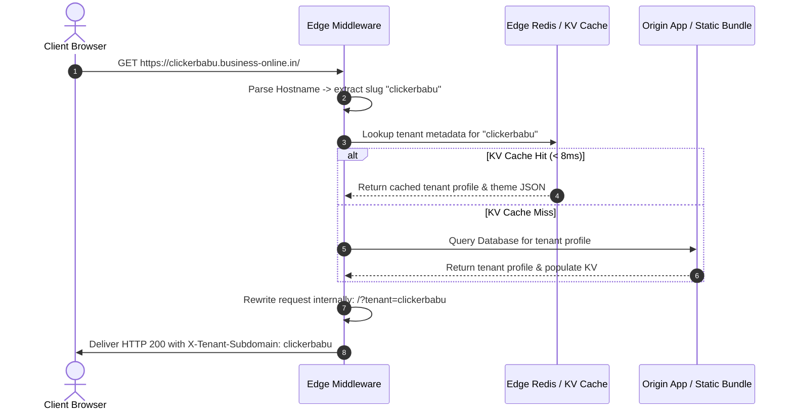
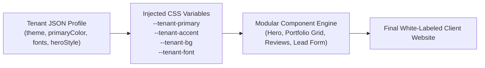

# business-online.in — System Architecture & Multi-Tenant Routing Specification

> **Document ID:** `DOC-02-ARCHITECTURE`  
> **Status:** Ground Truth / Active Blueprint  
> **Target Audience:** DevOps Engineers, Cloud Architects, Frontend/Backend Developers, AI Agents  
> **Version:** 1.0 (Enterprise Baseline)

---

## 1. High-Level Architecture Topology

The `business-online.in` infrastructure is engineered as a **distributed, edge-first multi-tenant platform** designed to serve millions of subdomains with sub-500ms global latency and zero downtime.

```mermaid
graph TD
    Client["End User / Client Device\n(Mobile / Desktop / PWA)"] --> DNS["Cloudflare Universal DNS\n(Wildcard *.business-online.in)"]
    
    DNS --> Edge["Cloudflare Edge Network / Reverse Proxy\n(SSL Termination & DDoS Shield)"]
    
    Edge --> EdgeRouter["Edge Middleware Router\n(cloudflare-worker.js / Vercel Edge)"]
    
    EdgeRouter -->|Host: business-online.in| SaaSOrigin["Main SaaS Portal & Justdial Directory\n(Discovery, Onboarding, Claimer)"]
    EdgeRouter -->|Host: app.business-online.in| VendorCMS["Vendor Admin Portal\n(CMS, Leads CRM, Settings)"]
    EdgeRouter -->|Host: api.business-online.in| CoreAPI["Central REST / GraphQL API\n(Auth, Webhooks, Payments)"]
    EdgeRouter -->|Host: [username].business-online.in| TenantEngine["Dynamic Tenant Storefront Engine\n(Bespoke Flagship or Modular Theme)"]
    EdgeRouter -->|Host: custom-domain.com| CustomSSL["Cloudflare for SaaS / Custom Hostname"]
    
    TenantEngine --> RedisKV["Edge Redis / KV Cache\n(Tenant Config, Metadata, Slug Lookup <10ms)"]
    TenantEngine --> DB[(PostgreSQL Database + Supabase RLS)]
    TenantEngine --> MediaCDN["Cloudflare R2 / S3 Global Media CDN\n(4K Photos, Video Streams, Assets)"]
```

---

## 2. Hostname Hierarchy & Routing Strategy

| Hostname Pattern | Routed Application | Cache Strategy | Purpose |
| :--- | :--- | :--- | :--- |
| **`business-online.in`**<br>`www.business-online.in` | **Main SaaS & Directory** | SWR (5 min edge) | Public Marketplace, Hyper-local Search Directory, Subdomain Claimer & Pricing |
| **`app.business-online.in`** | **Vendor Dashboard (CMS)** | Dynamic (No-cache) | Business owner admin panel, Lead management, Gallery uploads, Account settings |
| **`api.business-online.in`** | **Core API Services** | Micro-caching / None | REST endpoints, WhatsApp webhook receivers, Razorpay payment callbacks |
| **`cdn.business-online.in`** | **Media Storage Engine** | Immutable (365 days) | Optimized WebP images, 4K portfolio albums, cinema video assets |
| **`[username].business-online.in`** | **Tenant Storefront** | Edge Cache (1 hr + SWR) | White-labeled client website (e.g. `clickerbabu.business-online.in`) |
| **`customdomain.com`** | **White-label Custom Domain**| Edge Cache (1 hr + SWR) | Pro Tier tenant custom domain (e.g. `storybyclickerbabu.com`) |

---

## 3. Reserved Subdomain Blacklist

To prevent security vulnerabilities, impersonation, or platform collision, the following subdomains are strictly reserved and cannot be claimed by any tenant:

```json
[
  "www", "app", "api", "admin", "auth", "billing", "cdn", "mail", "status",
  "support", "help", "blog", "dashboard", "portal", "dev", "staging",
  "static", "assets", "payment", "checkout", "webhook", "root"
]
```

---

## 4. Edge Routing Execution Lifecycle

When an HTTP request enters the network, the Edge Worker executes the following sub-millisecond lifecycle:



---

## 5. Cloudflare Wildcard DNS & SSL Configuration

To achieve instant automated setup where any user registers and immediately gets their live website, the following DNS records must be configured in Cloudflare / Domain Registrar:

### A. Core DNS Records:
```
Type: CNAME
Name: * (Wildcard)
Target: business-online.in (or cname.vercel-dns.com / cloudflare worker)
Proxy Status: Proxied (Orange Cloud Active)
TTL: Auto
```

```
Type: A
Name: @ (Root)
Target: [Origin Server IP / Vercel Anycast IP]
Proxy Status: Proxied
TTL: Auto
```

```
Type: CNAME
Name: www
Target: business-online.in
Proxy Status: Proxied
TTL: Auto
```

### B. SSL/TLS Architecture:
* **Universal SSL:** Cloudflare automatically provisions and renews a wildcard certificate covering `business-online.in` and `*.business-online.in`.
* **Encryption Mode:** Set to **Full (Strict)** to ensure end-to-end TLS encryption between browser, Cloudflare Edge, and Origin server.
* **HSTS Enabled:** Strict-Transport-Security header enforced with a 1-year max-age.

---

## 6. Dynamic Theme & Frontend Token Injection

Tenant websites are rendered dynamically without generating separate static codebases for each user. Themes are applied at runtime using **CSS Custom Property Injection**:



### Supported Theme Presets:
1. **`luxury_dark_gold`** *(Clicker Babu Signature)*: High-fashion black (`#141210`), champagne gold (`#B89758`), Cormorant Garamond serif typography.
2. **`warm_terracotta`** *(Sweets & Gourmet Bakeries)*: Rich terracotta (`#C05621`), amber gold, Playfair Display.
3. **`vibrant_emerald`** *(Healthcare & Clinics)*: Medical teal (`#0D9488`), clean white, Plus Jakarta Sans.
4. **`royal_sapphire`** *(Boutiques & Corporate)*: Deep navy (`#1E3A8A`), electric blue, Inter.

---

## 7. Developer & Agent Verification Commands

To verify that routing and multi-tenant resolution are executing correctly on any environment:

```bash
# 1. Test Root SaaS Platform
curl -I -s http://localhost:3344/

# 2. Test Tenant Resolution via Query Parameter
curl -s "http://localhost:3344/?tenant=clickerbabu" | grep -i "Story by Clicker Babu"

# 3. Test Subdomain Header Emulation
curl -H "Host: sharmasweets.business-online.in" -s "http://localhost:3344/" | grep -i "Sharma Sweets"

# 4. Verify Edge Worker Syntax
node -e "import('./cloudflare-worker.js').then(() => console.log('Cloudflare Worker Syntax Valid!'))"
```
