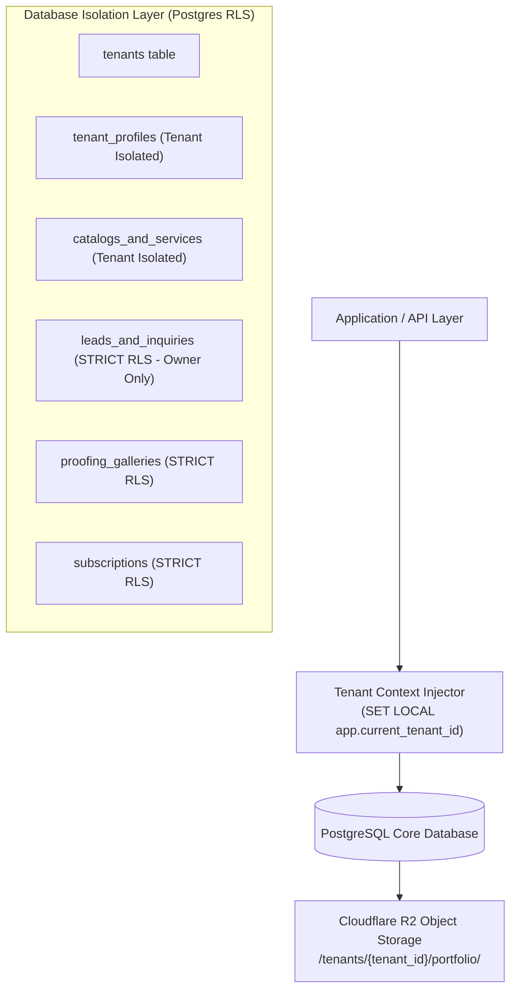

# business-online.in — Database Architecture, Data Models & Tenancy Security

> **Document ID:** `DOC-03-DATABASE`  
> **Status:** Ground Truth / Active Blueprint  
> **Target Audience:** Backend Engineers, Database Architects, DevOps, AI Agents  
> **Version:** 1.0 (Enterprise Baseline)

---

## 1. Multi-Tenant Data Isolation Strategy

To support millions of businesses with maximum efficiency, zero data leakage, and low infrastructure costs, `business-online.in` implements a **Shared Database with Discriminator Column (`tenant_id`) and PostgreSQL Row-Level Security (RLS)**.



### Why this Model Excels for Scale:
1. **Zero Database-per-Tenant Overhead:** No connection pool exhaustion or expensive multi-database provisioning.
2. **Instant Hyper-Local Directory Search:** Single-query cross-tenant searches (e.g. *"All Photographers in Raipur"*).
3. **Ironclad Data Protection:** PostgreSQL RLS guarantees that Tenant A can never query or mutate Tenant B's customer leads or private albums.

---

## 2. Complete PostgreSQL Schema Specification (DDL)

```sql
-- Enable necessary extensions
CREATE EXTENSION IF NOT EXISTS "uuid-ossp";
CREATE EXTENSION IF NOT EXISTS "pgcrypto";

-- ============================================================================
-- 1. CORE TENANTS TABLE
-- ============================================================================
CREATE TABLE tenants (
    id UUID PRIMARY KEY DEFAULT gen_random_uuid(),
    user_id UUID NOT NULL, -- References auth.users
    username VARCHAR(63) NOT NULL UNIQUE, -- e.g. 'clickerbabu'
    business_name VARCHAR(255) NOT NULL,
    category VARCHAR(64) NOT NULL, -- 'photography', 'restaurant', 'healthcare', etc.
    custom_domain VARCHAR(255) UNIQUE DEFAULT NULL,
    plan_tier VARCHAR(32) NOT NULL DEFAULT 'starter', -- 'starter', 'pro', 'enterprise'
    status VARCHAR(32) NOT NULL DEFAULT 'active', -- 'active', 'suspended', 'pending'
    is_verified BOOLEAN NOT NULL DEFAULT FALSE,
    created_at TIMESTAMPTZ NOT NULL DEFAULT NOW(),
    updated_at TIMESTAMPTZ NOT NULL DEFAULT NOW()
);

CREATE INDEX idx_tenants_username ON tenants(username);
CREATE INDEX idx_tenants_category ON tenants(category);
CREATE INDEX idx_tenants_custom_domain ON tenants(custom_domain);

-- ============================================================================
-- 2. TENANT PROFILES & BRANDING
-- ============================================================================
CREATE TABLE tenant_profiles (
    tenant_id UUID PRIMARY KEY REFERENCES tenants(id) ON DELETE CASCADE,
    tagline VARCHAR(255),
    about_bio TEXT,
    logo_url TEXT,
    favicon_url TEXT,
    hero_cover_url TEXT,
    
    -- Location Attributes
    city VARCHAR(128) NOT NULL DEFAULT 'Raipur',
    state VARCHAR(128) NOT NULL DEFAULT 'Chhattisgarh',
    address TEXT,
    pincode VARCHAR(16),
    latitude NUMERIC(10, 7),
    longitude NUMERIC(10, 7),
    
    -- Contact & Social Channels
    phone VARCHAR(32) NOT NULL,
    whatsapp VARCHAR(32) NOT NULL,
    email VARCHAR(255),
    instagram VARCHAR(128),
    youtube VARCHAR(128),
    google_maps_url TEXT,
    
    -- Dynamic Theme Tokens (JSONB)
    theme_config JSONB NOT NULL DEFAULT '{
        "preset": "luxury_dark_gold",
        "primaryColor": "#B89758",
        "accentColor": "#D4AF37",
        "bg": "#141210",
        "textColor": "#E6DCCA",
        "fontHeading": "Cormorant Garamond",
        "fontBody": "Plus Jakarta Sans"
    }'::jsonb,
    
    badges TEXT[] DEFAULT ARRAY['Verified Business'],
    rating NUMERIC(3, 2) DEFAULT 5.00,
    reviews_count INT DEFAULT 1,
    updated_at TIMESTAMPTZ NOT NULL DEFAULT NOW()
);

CREATE INDEX idx_profiles_city ON tenant_profiles(city);

-- ============================================================================
-- 3. CATALOGS, SERVICES & PORTFOLIO
-- ============================================================================
CREATE TABLE catalogs_and_services (
    id UUID PRIMARY KEY DEFAULT gen_random_uuid(),
    tenant_id UUID NOT NULL REFERENCES tenants(id) ON DELETE CASCADE,
    title VARCHAR(255) NOT NULL,
    description TEXT,
    price_display VARCHAR(64), -- e.g. '₹950 / kg' or 'From ₹75,000'
    price_numeric NUMERIC(12, 2) DEFAULT NULL,
    image_url TEXT NOT NULL,
    category_tag VARCHAR(64),
    is_featured BOOLEAN DEFAULT TRUE,
    display_order INT DEFAULT 0,
    created_at TIMESTAMPTZ NOT NULL DEFAULT NOW()
);

CREATE INDEX idx_catalogs_tenant_id ON catalogs_and_services(tenant_id);

-- ============================================================================
-- 4. LEADS & INQUIRIES CRM (STRICT PRIVATE ACCESS)
-- ============================================================================
CREATE TABLE leads_and_inquiries (
    id UUID PRIMARY KEY DEFAULT gen_random_uuid(),
    tenant_id UUID NOT NULL REFERENCES tenants(id) ON DELETE CASCADE,
    customer_name VARCHAR(128) NOT NULL,
    customer_phone VARCHAR(32) NOT NULL,
    customer_email VARCHAR(255),
    service_interested VARCHAR(255),
    event_date DATE,
    event_location VARCHAR(255),
    budget_range VARCHAR(64),
    message TEXT,
    status VARCHAR(32) NOT NULL DEFAULT 'new', -- 'new', 'contacted', 'booked', 'archived'
    whatsapp_dispatched BOOLEAN DEFAULT FALSE,
    deal_value NUMERIC(12, 2) DEFAULT NULL,
    created_at TIMESTAMPTZ NOT NULL DEFAULT NOW()
);

CREATE INDEX idx_leads_tenant_id ON leads_and_inquiries(tenant_id);
CREATE INDEX idx_leads_created_at ON leads_and_inquiries(created_at DESC);

-- ============================================================================
-- 5. PHOTOGRAPHY PROOFING GALLERIES (VERTICAL SPECIFIC)
-- ============================================================================
CREATE TABLE proofing_galleries (
    id UUID PRIMARY KEY DEFAULT gen_random_uuid(),
    tenant_id UUID NOT NULL REFERENCES tenants(id) ON DELETE CASCADE,
    client_name VARCHAR(128) NOT NULL,
    event_title VARCHAR(255) NOT NULL, -- e.g. "Aditi & Harshwardhan Royal Wedding"
    event_date DATE,
    slug VARCHAR(128) NOT NULL,
    access_pin VARCHAR(16), -- Optional 4-digit client PIN
    cover_image_url TEXT,
    photos_count INT DEFAULT 0,
    is_selection_open BOOLEAN DEFAULT TRUE,
    selection_deadline TIMESTAMPTZ,
    created_at TIMESTAMPTZ NOT NULL DEFAULT NOW()
);

CREATE UNIQUE INDEX idx_galleries_tenant_slug ON proofing_galleries(tenant_id, slug);

-- ============================================================================
-- 6. SUBSCRIPTIONS & RAZORPAY BILLING
-- ============================================================================
CREATE TABLE subscriptions (
    tenant_id UUID PRIMARY KEY REFERENCES tenants(id) ON DELETE CASCADE,
    razorpay_customer_id VARCHAR(128),
    razorpay_subscription_id VARCHAR(128),
    plan_id VARCHAR(64) NOT NULL DEFAULT 'starter_free',
    current_period_start TIMESTAMPTZ,
    current_period_end TIMESTAMPTZ,
    status VARCHAR(32) NOT NULL DEFAULT 'active', -- 'active', 'past_due', 'canceled'
    cancel_at_period_end BOOLEAN DEFAULT FALSE,
    updated_at TIMESTAMPTZ NOT NULL DEFAULT NOW()
);
```

---

## 3. PostgreSQL Row-Level Security (RLS) Policies

RLS guarantees that tenant data is protected at the database engine layer:

```sql
-- Enable RLS on all sensitive tables
ALTER TABLE tenants ENABLE ROW LEVEL SECURITY;
ALTER TABLE tenant_profiles ENABLE ROW LEVEL SECURITY;
ALTER TABLE catalogs_and_services ENABLE ROW LEVEL SECURITY;
ALTER TABLE leads_and_inquiries ENABLE ROW LEVEL SECURITY;
ALTER TABLE proofing_galleries ENABLE ROW LEVEL SECURITY;
ALTER TABLE subscriptions ENABLE ROW LEVEL SECURITY;

-- 1. PUBLIC READ: Anyone can view active tenant profiles & catalogs
CREATE POLICY "Public can view active tenants"
ON tenants FOR SELECT
USING (status = 'active');

CREATE POLICY "Public can view tenant profiles"
ON tenant_profiles FOR SELECT
USING (TRUE);

CREATE POLICY "Public can view catalogs"
ON catalogs_and_services FOR SELECT
USING (TRUE);

-- 2. PUBLIC WRITE: Public visitors can insert new leads (Lead Form / Inquiry)
CREATE POLICY "Public can submit inquiries"
ON leads_and_inquiries FOR INSERT
WITH CHECK (TRUE);

-- 3. STRICT TENANT OWNER ACCESS: Only authenticated tenant owner can view/manage their leads
CREATE POLICY "Tenants can view only their own leads"
ON leads_and_inquiries FOR ALL
USING (
    tenant_id IN (
        SELECT id FROM tenants WHERE user_id = auth.uid()
    )
);

-- 4. STRICT TENANT OWNER ACCESS: Profile & Catalog Mutations
CREATE POLICY "Tenants can update their own profile"
ON tenant_profiles FOR UPDATE
USING (
    tenant_id IN (
        SELECT id FROM tenants WHERE user_id = auth.uid()
    )
);
```

---

## 4. Media Storage Layout (Cloudflare R2 / S3)

Media assets are partitioned hierarchically in Cloudflare R2 object storage:

```
r2://business-online-media/
├── tenants/
│   ├── {tenant_id}/
│   │   ├── branding/
│   │   │   ├── logo.webp
│   │   │   └── hero_cover.webp
│   │   ├── catalog/
│   │   │   ├── srv_01.webp
│   │   │   └── srv_02.webp
│   │   └── proofing/
│   │       └── {gallery_slug}/
│   │           ├── original/
│   │           │   └── DSC_0001.raw
│   │           ├── preview_4k/
│   │           │   └── DSC_0001.webp
│   │           └── thumbs/
│   │               └── DSC_0001_thumb.webp
```

---

## 5. Instructions for Future Developers & AI Agents

1. **Always query through RLS-enabled clients:** When calling Supabase or PostgreSQL from the API, ensure session context (`auth.uid()`) is passed.
2. **Never execute raw un-partitioned queries on `leads_and_inquiries`** without an explicit `WHERE tenant_id = ?` clause.
3. **Use WebP/AVIF format exclusively:** All uploaded media must pass through the edge optimization pipeline before being saved to R2 storage.
