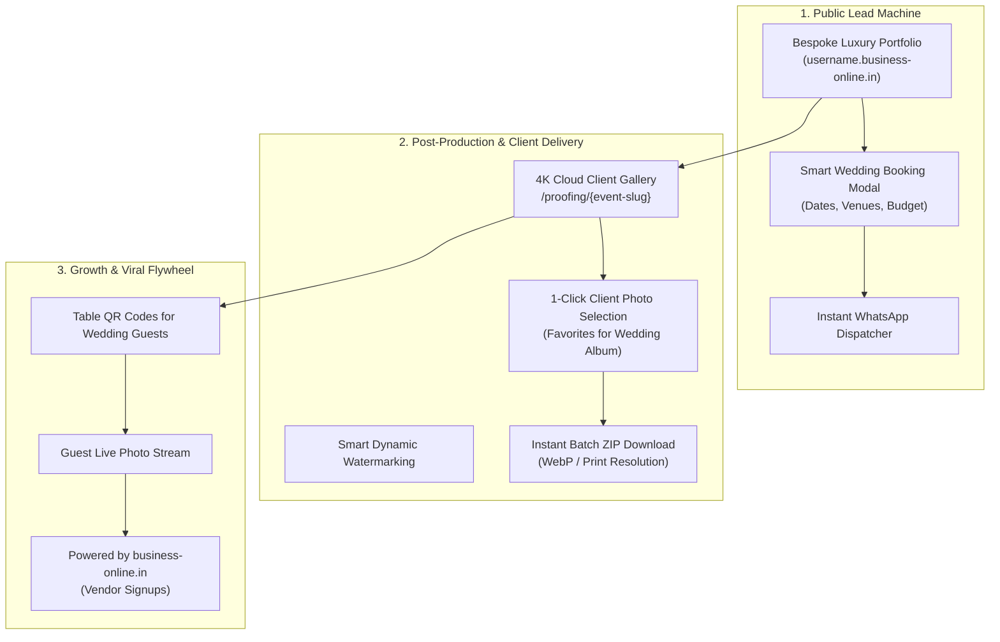

# business-online.in — Photography & Cinema SaaS Ecosystem Deep-Dive

> **Document ID:** `DOC-04-PHOTOGRAPHY`  
> **Status:** Ground Truth / Active Blueprint  
> **Target Audience:** Product Designers, Full-Stack Engineers, AI Agents, Growth Team  
> **Version:** 1.0 (Enterprise Baseline)

---

## 1. Executive Summary: Why Photography is the Hero Vertical

The wedding photography and couture cinematography market in India generates over **$3 Billion annually**, with individual royal wedding photography contracts ranging from **₹1,00,000 to ₹25,00,000+**.

Despite high revenue, photographers face critical operational bottlenecks:
1. **Inefficient Photo Delivery (Google Drive / Hard Drive Chaos):** Photographers share raw Google Drive links that look unprofessional, expire, or buffer on mobile devices.
2. **The "Album Selection" Nightmare:** Clients take 6–9 months to select 150 photos out of 3,000 wedding photos, delaying final album printing and final payment milestones.
3. **Slow, Bloated Portfolios:** WordPress sites take 5–8 seconds to load heavy images, losing impatient luxury clients.

`business-online.in` solves this entire lifecycle through a **unified, ultra-luxury Photography SaaS Cloud**.

---

## 2. The Complete Photography Product Suite



---

## 3. Core Modules & Feature Specifications

### Module A: The Luxury Public Portfolio (`[username].business-online.in`)
* **Signature Aesthetic:** Dark obsidian backgrounds (`#141210`), warm champagne gold accents (`#B89758`), Cormorant Garamond serif headers, and Plus Jakarta Sans body typography.
* **Momentum Scroll & Micro-Animations:** Lenis smooth scrolling with GPU-accelerated parallax on hero images.
* **Cinema Showreel Modal:** High-bitrate 4K video overlay with custom audio controls and full-screen cinema badge.
* **Category Filtering:** Smooth tab switching between *Destination Weddings, Pre-Wedding Films, Royal Pheras, Candid Photojournalism*.
* **Editorial Lightbox:** Deep zoom capability on high-resolution wedding portraits.

### Module B: 4K Client Proofing & Selection Engine
* **Private PIN Protection:** Each client receives a unique URL (`/proofing/aditi-harsh`) secured by an optional 4-digit PIN.
* **Smart Album Selection:**
  - Client browses through 2,000+ photos in a fluid Pinterest-style grid.
  - Heart icon click adds photo to *"Album Selection List"* (e.g. `Selected: 114 / 150 Target`).
  - Client clicks **"Lock & Submit Selection to Studio"**, which immediately notifies the photographer via WhatsApp.
* **Smart Dynamic Watermarking:** In-browser canvas watermarking protects raw images from unauthorized screenshotting before selection is approved.

### Module C: Smart Lead & Booking Funnel
* Interactive multi-step inquiry modal capturing:
  1. Bride & Groom Names
  2. Event Date(s) & Duration (e.g. 3-Day Destination Wedding)
  3. Wedding City / Venue (e.g. Udaipur, Fairmont Jaipur, Raipur)
  4. Required Services (Cinema, Candid, Traditional, Pre-Wedding)
  5. Estimated Budget Range
* **Instant WhatsApp Auto-Formatting:** Automatically formats the inquiry into a clean WhatsApp message dispatched directly to the photographer's verified phone number.

---

## 4. The Live Gold Benchmark: "Story by Clicker Babu"

The codebase currently in `storyby_clickerbabu` serves as the **Production Reference Implementation (Flagship Tenant #1)**.

### Architectural Hallmarks of the Benchmark:
* **Deep Google Graph Structured Data:** Pre-configured `WebSite`, `ProfessionalService`, `Person`, and `OfferCatalog` schema in `index.html`.
* **Zero External CDN Dependencies:** Pure local CSS, optimized JavaScript, and local WebP assets ensuring sub-300ms First Contentful Paint (FCP).
* **Direct Lead Channel:** Direct integration with WhatsApp (`+91 70474 70742`) and inquiry modals.

---

## 5. The Guest QR Code Flywheel (Viral Distribution)

At high-end Indian weddings, 500 to 1,500 guests attend multiple events (Mehendi, Sangeet, Pheras). Photographers can place small branded acrylic table stands with QR codes:

```
┌────────────────────────────────────────────────────────┐
│             SCAN TO VIEW WEDDING PHOTOS                │
│                                                        │
│                     ┌───────────┐                      │
│                     │  QR CODE  │                      │
│                     └───────────┘                      │
│                                                        │
│         Aditi & Harshwardhan's Royal Wedding           │
│           Captured by Story by Clicker Babu            │
│                                                        │
│       ⚡ Powered by business-online.in — Get Yours     │
└────────────────────────────────────────────────────────┘
```

### Business Impact:
1. **500+ Guests** scan the code during the reception.
2. They view live event highlights on `clickerbabu.business-online.in`.
3. Every guest sees the footer: *"Claim your business website in 60s on business-online.in"*.
4. **Organic, Zero-CAC acquisition** of local doctors, restaurant owners, caterers, and jewelers attending the wedding!

---

## 6. Instructions for Developers & Future AI Agents

1. **Maintain Image Compression Standards:** Never serve uncompressed JPEG/PNG images on portfolio grids. Enforce WebP with quality 80 and maximum width 1920px for hero images and 800px for thumbnails.
2. **Preserve Clicker Babu as the Hero Preset:** When introducing new industry themes, never degrade the bespoke styling of `preset: luxury_dark_gold`.
3. **Mobile First Verification:** Test all lightbox touch gestures (swipe next/prev, pinch zoom) on iOS Safari and Chrome Android.
