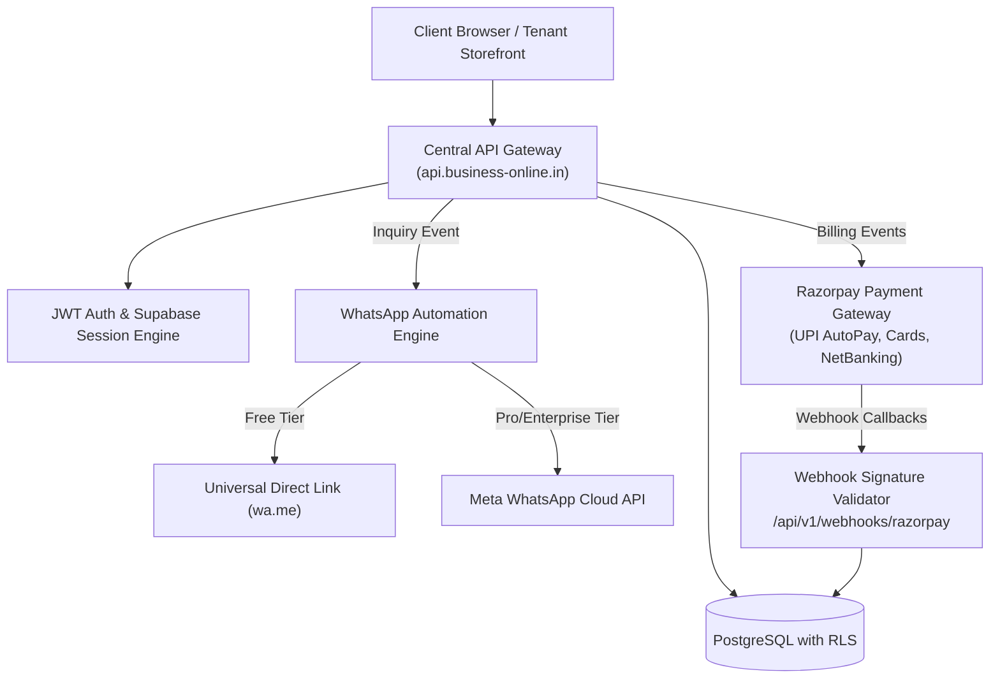

# business-online.in — API Specification, WhatsApp Automation & Payment Gateway

> **Document ID:** `DOC-05-API`  
> **Status:** Ground Truth / Active Blueprint  
> **Target Audience:** Backend Developers, API Engineers, DevOps, AI Agents  
> **Version:** 1.0 (Enterprise Baseline)

---

## 1. Integration Topology & Architecture

The API layer on `api.business-online.in` is an edge-first REST engine orchestrating **Tenant Onboarding, Lead Captures, WhatsApp Automations, and Razorpay Subscriptions**.



---

## 2. Core REST API Endpoints Specification

### A. Tenant Lifecycle & Resolution

#### `POST /api/v1/tenants/onboard`
* **Description:** Instant 60-second onboarding endpoint for new business owners.
* **Access:** Public
* **Request Payload:**
```json
{
  "username": "royalbakery",
  "businessName": "Royal Artisan Bakery",
  "category": "restaurant",
  "city": "Raipur",
  "phone": "919876543210",
  "tagline": "Fresh European Sourdough & Custom Wedding Cakes"
}
```
* **Response (201 Created):**
```json
{
  "success": true,
  "tenantId": "t_9a2f7c11",
  "subdomainUrl": "https://royalbakery.business-online.in",
  "temporaryToken": "jwt_eyJh...",
  "message": "Storefront generated successfully in 60s!"
}
```

#### `GET /api/v1/tenants/:username`
* **Description:** Fetches complete cached profile, branding, and catalog for storefront rendering.
* **Access:** Public (Edge Cached via SWR)
* **Response (200 OK):** Standard `BusinessOnlineTenantProfile` JSON.

---

### B. Leads & Inquiries Engine

#### `POST /api/v1/inquiries`
* **Description:** Captures incoming customer inquiries from any tenant website and triggers instant notifications.
* **Access:** Public
* **Request Payload:**
```json
{
  "tenantId": "t_cb_001",
  "customerName": "Pooja Sharma",
  "customerPhone": "919893011223",
  "customerEmail": "pooja@gmail.com",
  "serviceInterested": "Royal Destination Wedding Cinema",
  "eventDate": "2026-11-20",
  "eventLocation": "Jagmandir Palace, Udaipur",
  "message": "Looking for 3-day wedding photography and pre-wedding film."
}
```
* **Response (201 Created):**
```json
{
  "success": true,
  "inquiryId": "inq_784920",
  "whatsappRedirectUrl": "https://wa.me/917047470742?text=New%20Inquiry%20from%20Pooja...",
  "status": "dispatched"
}
```

#### `GET /api/v1/leads`
* **Description:** Fetches vendor's leads CRM table with status, notes, and deal values.
* **Access:** Authenticated (Tenant Owner Only via RLS)

---

### C. Photography Proofing & Photo Selection

#### `POST /api/v1/proofing/galleries`
* **Description:** Creates a new private 4K client gallery.
* **Access:** Authenticated (Pro/Enterprise Tenant Only)
* **Request Payload:**
```json
{
  "clientName": "Aditi & Harshwardhan",
  "eventTitle": "Royal Udaipur Palace Wedding",
  "eventDate": "2026-12-15",
  "slug": "aditi-harshwardhan",
  "accessPin": "4821",
  "targetSelectionCount": 150
}
```

#### `POST /api/v1/proofing/selections/submit`
* **Description:** Client locks and submits their final selected photos for album printing.
* **Access:** Public with PIN verification
* **Request Payload:**
```json
{
  "galleryId": "gal_381029",
  "selectedPhotoIds": ["IMG_0012", "IMG_0045", "IMG_0089"],
  "clientNotes": "Please retouch bride portrait on IMG_0045."
}
```

---

## 3. WhatsApp Automation Architecture

### Mode 1: Client-Side Universal Link (Free Tier - 100% Free & Zero Setup)
Used by default across all Starter tenants:
```javascript
function generateWhatsAppLink(vendorPhone, businessName, clientName, service) {
  const cleanPhone = vendorPhone.replace(/[^0-9]/g, '');
  const text = encodeURIComponent(
    `Hello ${businessName}! 👋\n` +
    `I found your profile on business-online.in.\n\n` +
    `• Name: ${clientName}\n` +
    `• Inquiring for: ${service}\n\n` +
    `Please share your packages and availability!`
  );
  return `https://wa.me/${cleanPhone}?text=${text}`;
}
```

### Mode 2: Meta WhatsApp Cloud API (Pro/Enterprise - Automated Server Bot)
For paying subscribers, notifications are dispatched programmatically to the vendor's WhatsApp within 2 seconds of form submission:

```json
{
  "messaging_product": "whatsapp",
  "to": "917047470742",
  "type": "template",
  "template": {
    "name": "new_lead_notification_v1",
    "language": { "code": "en_US" },
    "components": [
      {
        "type": "body",
        "parameters": [
          { "type": "text", "text": "Pooja Sharma" },
          { "type": "text", "text": "Royal Destination Wedding Cinema" },
          { "type": "text", "text": "Udaipur (20 Nov 2026)" },
          { "type": "text", "text": "919893011223" }
        ]
      }
    ]
  }
}
```

---

## 4. Razorpay Subscription & Webhook Pipeline

### Plan IDs Standard:
1. `plan_starter_free` — Free forever ($0).
2. `plan_pro_monthly_499` — ₹499 / Month (Auto-recurring UPI / Card).
3. `plan_pro_yearly_4999` — ₹4,999 / Year (2 Months Free).
4. `plan_enterprise_yearly_14999` — ₹14,999 / Year (Full Photography & Studio Suite).

### Webhook Verification Handler (`/api/v1/webhooks/razorpay`):
```javascript
import crypto from 'crypto';

export async function handleRazorpayWebhook(rawBody, signature, secret) {
  const expectedSignature = crypto
    .createHmac('sha256', secret)
    .update(rawBody)
    .digest('hex');

  if (expectedSignature !== signature) {
    throw new Error('Invalid Razorpay signature: Unauthorized webhook');
  }

  const event = JSON.parse(rawBody);
  
  if (event.event === 'subscription.charged') {
    const tenantId = event.payload.subscription.entity.notes.tenant_id;
    // Upgrade tenant to Pro and activate custom domain capability
    await updateTenantPlan(tenantId, 'pro', 'active');
  }
}
```

---

## 5. Instructions for Developers & Future AI Agents

1. **Never expose Meta Access Tokens or Razorpay Secrets:** All API keys must reside in environment variables (`META_WA_TOKEN`, `RAZORPAY_KEY_SECRET`).
2. **Always validate incoming signatures on webhooks:** Reject any unverified webhook call with HTTP 401.
3. **Use Upstash / Redis Rate Limiting:** Enforce a rate limit of 10 requests per minute on `/api/v1/inquiries` per IP to prevent spam bot submissions.
