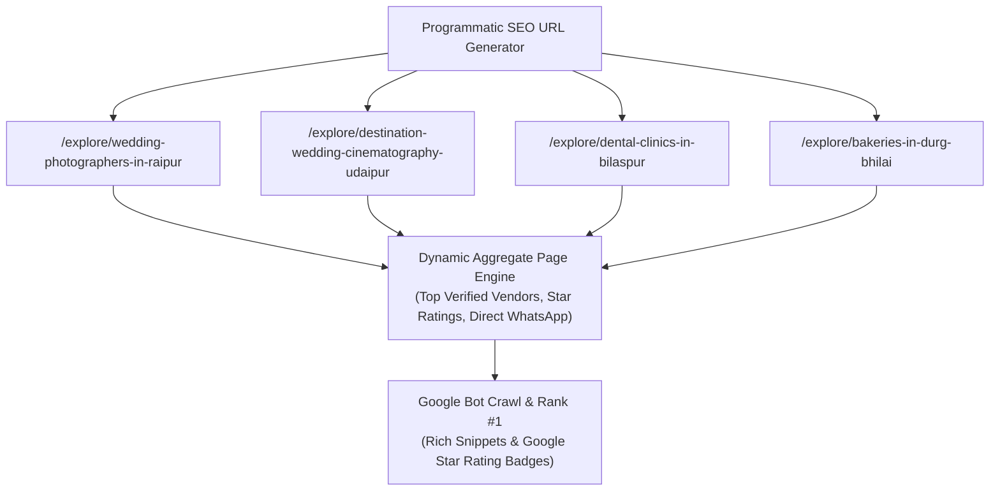

# business-online.in — Hyper-Local SEO, Programmatic Scaling & Directory Discovery

> **Document ID:** `DOC-06-SEO`  
> **Status:** Ground Truth / Active Blueprint  
> **Target Audience:** SEO Specialists, Full-Stack Developers, Growth Hackers, AI Agents  
> **Version:** 1.0 (Enterprise Baseline)

---

## 1. Executive SEO Strategy & Search Moat

In India, **over 82% of high-ticket local transactions** (wedding photography, dental implants, luxury banquet bookings, gourmet gifting) begin with a Google search:
* *"Best luxury wedding photographer in Raipur"*
* *"Top candid wedding cinema Chhattisgarh"*
* *"Pure desi ghee sweets in Pandri Raipur"*
* *"Painless dental clinic Shankar Nagar"*

While platforms like Justdial buy expensive Google Ads, `business-online.in` achieves organic rank #1 through an **Automated Programmatic SEO Engine and Deep Schema.org Graph Integration**.

---

## 2. The Programmatic SEO Matrix (500,000+ Dynamic Pages)

The platform programmatically generates hyper-local directory pages using a scalable formula:

$$\text{Category} \times \text{Tier-1/2/3 Indian Cities} \times \text{Localities} = \text{500,000+ Search Pages}$$



### URL Structure Standards:
* **Category + City:** `https://business-online.in/explore/{category}-in-{city}`
* **Category + Locality + City:** `https://business-online.in/explore/{category}-in-{locality}-{city}`
* **Direct Tenant Storefront:** `https://{username}.business-online.in/` (with canonical tag pointing to their branded domain).

---

## 3. Automated Schema.org Structured Data Engine

Every tenant storefront automatically renders a rich JSON-LD graph matching Google's **LocalBusiness, ProfessionalService, and Review standards**:

```html
<script type="application/ld+json">
{
  "@context": "https://schema.org",
  "@graph": [
    {
      "@type": "WebSite",
      "@id": "https://clickerbabu.business-online.in/#website",
      "url": "https://clickerbabu.business-online.in/",
      "name": "Story by Clicker Babu",
      "description": "Award-winning luxury wedding photography and couture films based in Raipur."
    },
    {
      "@type": "ProfessionalService",
      "@id": "https://clickerbabu.business-online.in/#business",
      "name": "Story by Clicker Babu",
      "url": "https://clickerbabu.business-online.in/",
      "telephone": "+917047470742",
      "priceRange": "$$$$",
      "image": "https://clickerbabu.business-online.in/assets/images/clicker_babu_lead_artist.webp",
      "address": {
        "@type": "PostalAddress",
        "streetAddress": "Civil Lines",
        "addressLocality": "Raipur",
        "addressRegion": "Chhattisgarh",
        "postalCode": "492001",
        "addressCountry": "IN"
      },
      "geo": {
        "@type": "GeoCoordinates",
        "latitude": 21.2514,
        "longitude": 81.6296
      },
      "aggregateRating": {
        "@type": "AggregateRating",
        "ratingValue": "4.9",
        "reviewCount": "84",
        "bestRating": "5"
      },
      "hasOfferCatalog": {
        "@type": "OfferCatalog",
        "name": "Luxury Wedding Photography Services",
        "itemListElement": [
          {
            "@type": "Offer",
            "itemOffered": {
              "@type": "Service",
              "name": "Royal Destination Wedding Cinema & Photography"
            }
          }
        ]
      }
    }
  ]
}
</script>
```

---

## 4. Hyper-Local Justdial Directory Ranking Algorithm

When a visitor searches for vendors on `business-online.in`, the internal ranking score ($S$) is calculated using the following multi-factor formula:

$$S = (W_{\text{verified}} \times 40) + (R \times 10) + (N_{\text{reviews}} \times 0.5) + (W_{\text{pro}} \times 30) - (D_{\text{km}} \times 2)$$

Where:
* $W_{\text{verified}}$ = 1 if verified badge is active, else 0.
* $R$ = Average review rating (1.0 to 5.0).
* $N_{\text{reviews}}$ = Total number of verified customer reviews.
* $W_{\text{pro}}$ = 1 for Pro/Enterprise tier subscribers, else 0.
* $D_{\text{km}}$ = Distance in kilometers from the searcher's detected location.

---

## 5. Automated Sitemaps & Instant Google Indexing API

The sitemap architecture is dynamically split into sub-sitemaps to handle millions of URLs:

```
https://business-online.in/sitemap.xml (Sitemap Index)
├── sitemap-tenants-1.xml       (50,000 Tenant Subdomains)
├── sitemap-tenants-2.xml       (Next 50,000 Tenants)
├── sitemap-categories.xml      (Programmatic City x Category URLs)
└── sitemap-static.xml          (Core SaaS & Legal Pages)
```

### Instant Google Indexing Integration:
When a new business registers or updates their catalog, our server automatically triggers the **Google Indexing API**:

```javascript
import { google } from 'googleapis';

export async function requestGoogleIndexing(url, type = 'URL_UPDATED') {
  const jwtClient = new google.auth.JWT(
    process.env.GOOGLE_CLIENT_EMAIL,
    null,
    process.env.GOOGLE_PRIVATE_KEY.replace(/\\n/g, '\n'),
    ['https://www.googleapis.com/auth/indexing']
  );

  await jwtClient.authorize();
  await google.indexing({ version: 'v3', auth: jwtClient }).urlNotifications.publish({
    requestBody: { url, type }
  });
}
```

---

## 6. Instructions for Developers & Future AI Agents

1. **Strict Canonical Enforcement:** Every page must include an unambiguous `<link rel="canonical" href="...">` tag to prevent duplicate content penalties between subdomains and root directories.
2. **Core Web Vitals Thresholds:**
   - **LCP (Largest Contentful Paint):** $\le 1.2\text{s}$
   - **FID / INP (Interaction to Next Paint):** $\le 50\text{ms}$
   - **CLS (Cumulative Layout Shift):** $0.00$
3. **Never render dummy or placeholder text in metadata:** All title and description tags must be dynamically populated from the tenant profile JSON.
